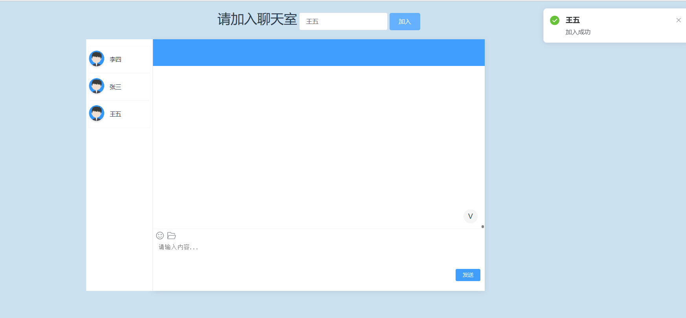
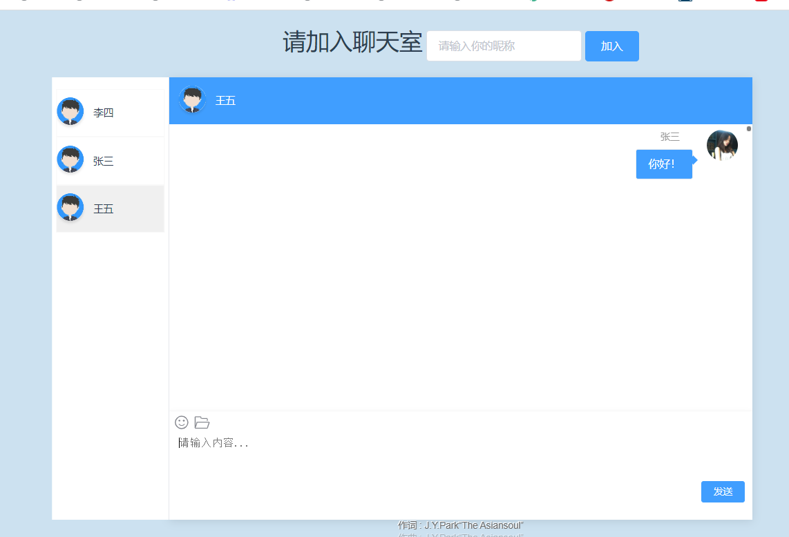
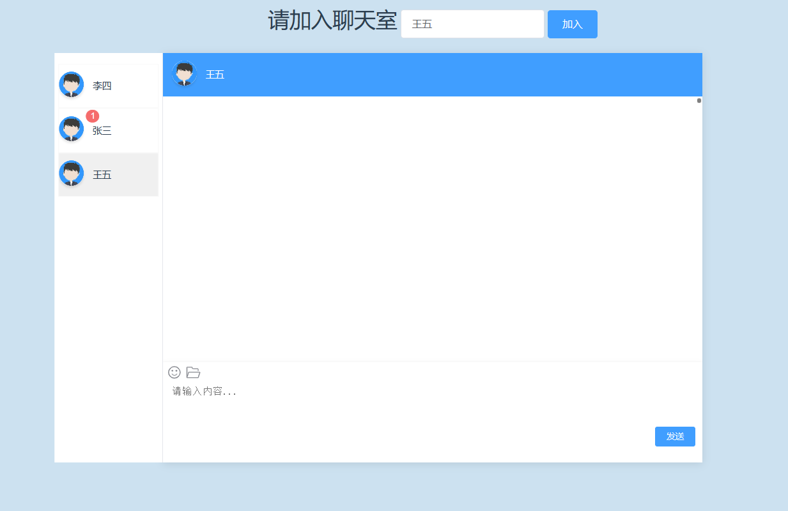
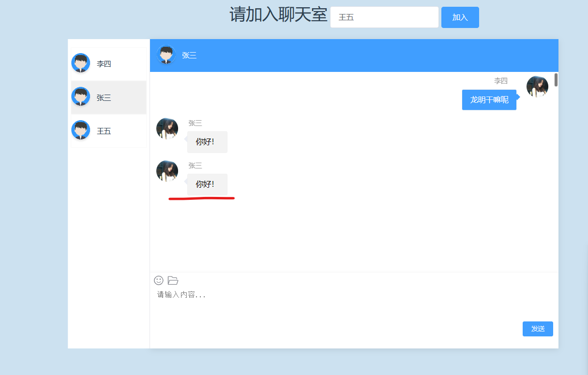
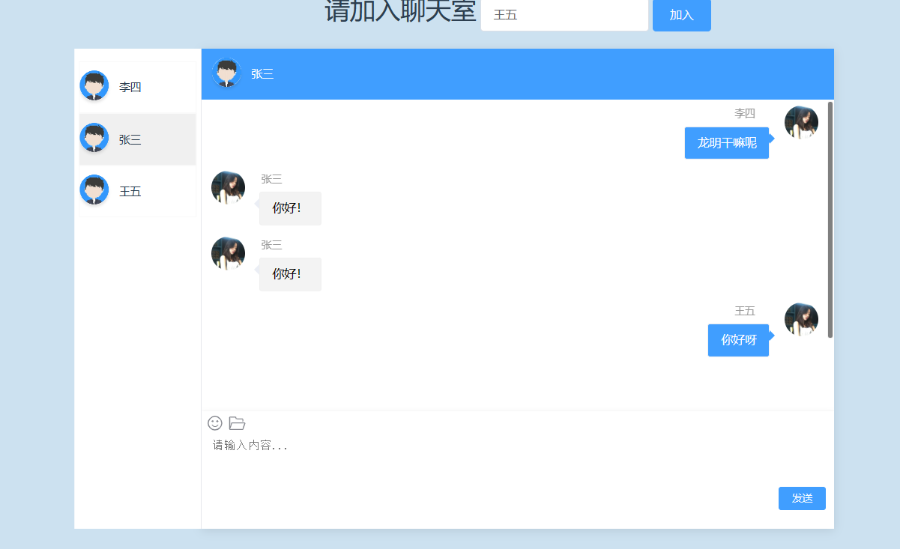

# Netty-WebSocket-chat-demo

目录：

[TOC]

#### 介绍
前端vue jchat组件 + 后端springboot 实现的netty+WebSocket在线聊天 简单demo

#### 使用说明

#### 前端

已经给出vue页面和后端主要代码

正常设置路由，成功路由到chat页面即可开始连接后端代码，连接失败会报错，不影响

#### 后端

在你新建的boot项目**启动目录**下将给出的后端目录粘贴即可，并在**主启动类**加上以下代码

```java
     try {
            NettyServer.start();
        } catch (InterruptedException e) {
            e.printStackTrace();
        }
```

只做了部分功能，毕竟是demo。

#### 演示

加入聊天室   这里会显示自己，具体是后端获取了在线人员，大家可以作改动



指定一个人发送消息 （  其实这里是可以给自己发的。。。也可以改动）



接收方





可以进行回复




## 逻辑BUG肯定是有的，可以自己完善一下，这里只是简单的demo
